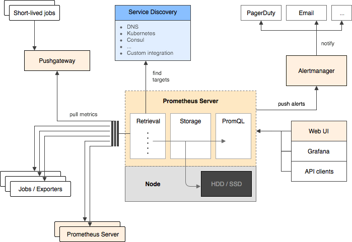

### micro-Services-Tutorial
 微服务最早由Martin Fowler与James Lewis于2014年共同提出，微服务架构风格是一种使用一套小服务来开发单个应用的方式途径，每个服务运行在自己的进程中，并使用轻量级机制通信，通常是HTTP API，这些服务基于业务能力构建，并能够通过自动化部署机制来独立部署，这些服务使用不同的编程语言实现，以及不同数据存储技术，并保持最低限度的集中式管理。然而微服务又需要限流器(Rate Limiter)，数据传输(Trasport 序列化和反序列化),日志(Logging),指标(Metrics)
,断路器(Circuit breaker),请求追踪(Request tracing ),服务发现(Service Discovery),因此就想写一篇关于微服务和微服务组件的总结来记录下自己使用优化的过程．

#### promethues的安装
<p align="center">

</p>

在安装promethues的时候，这里我选择用docker镜像和docker-compose启动grafana.

首先安装docker环境，这个可以根据电脑系统的不同，选择不同的安装方式。
* [Mac安装](https://docs.docker.com/docker-for-mac/install/)
* [Unbantu安装](https://docs.docker.com/install/linux/docker-ce/ubuntu/)
* [Windows安装](https://docs.docker.com/docker-for-windows/install/)
* [centos安装](https://docs.docker.com/install/linux/docker-ce/centos/)

查看docker版本:
```docker
> docker --version

Docker version 18.06.0-ce, build 0ffa825
```
然后是安装docker-conpose.
```bash
> curl -L https://github.com/docker/compose/releases/download/1.22.0/docker-compose-`uname -s`-`uname -m` > > > > /usr/local/bin/docker-compose

> chmod +x /usr/local/bin/docker-compose

> docker-compose --version
docker-compose version 1.21.2, build a133471
```
到这里docker 和docker-compose 都已经安装好了.

如果你想在服务器上一键安装docker和docker-compose，可以写一个脚本bash，然后部署一键安装.
```bash
#!/usr/bin/env bash

yum-config-manager \
    --add-repo \
    https://download.docker.com/linux/centos/docker-ce.repo;

yum-config-manager --enable docker-ce-edge;

yum-config-manager --disable docker-ce-edge;

yum install docker-ce;

systemctl start docker.service;
systemctl enable docker.service;

docker --version;

curl -L https://github.com/docker/compose/releases/download/1.22.0/docker-compose-`uname -s`-`uname -m` > /usr/local/bin/docker-compose

chmod +x /usr/local/bin/docker-compose;

docker-compose --version;
```
这样的一个脚本就可以实现docker和docker-compose一起安装在系统中了,接着就可以开启promethues和grafana安装了.

编写promethues.yaml文件:
```yaml
global:
  scrape_interval:     30s # 拉取时间间隔30s
  evaluation_interval: 30s # 评估规则的时间间隔30s，prometheus使用规则产生新的时间序列数据或者产生警报。
#alerting:
#  alertmanagers:
#  - static_configs:
#    - targets:
#      - altermanager:9093   #设置altermanager的地址
#rule_files:# 报警规则文件
#  - "prometheus.rules"   # 设置报警规则
  
scrape_configs:
  - job_name: 'prometheus'   #任务名称-这里监控prometheus自身
    static_configs:
      - targets: ['52.76.11.148:9090']   #这个自带的默认监控prometheus所在机器的prometheus状态
  - job_name: "linux"      # 自己定义的监控的job_name
    static_configs:
      - targets: ['52.76.11.148:9091']   #指向pushgateway.
        labels:
          instance: linux    #新添加的标签，可以自定义
    scrape_interval: 60s
  - job_name: request_processing_seconds
    static_configs:
      - targets: ['120.92.138.54:8000']
        labels:
          instance: request_processing_seconds

```
global为全局配置块。rule_files指向告警规则配置文件。因为promethus工作在拉模型下，所以scrape_configs里的配置告诉prometheus从什么endpoints拉取数据。

scrape_configs控制prometheus监控哪些资源。由于prometheus通过HTTP endpoint暴露的它本身的监控数据，prometheus也能够监控本身的健康情况。

在默认的配置里有一个单独的job_name作为监控的对象名称，每个job-name不可以重复，其中static_configs下的targets参数很关键，决定了监听的服务地址。这个job_name叫作prometheus的它采集prometheus服务本身输出的时间序列数据。这个job_name包含了一个单独的、静态配置的目标：在端口9090上的localhost这里我监控了服务器52.76.11.148。

prometheus默认会通过目标的/metrics路径采集metrics。收集到的时间序列会详述prometheus服务的状态和性能.

接着我们需要配置docker-compose启动promethues和grafana监控
```docker-compose
version: '2'
services:

  prometheus:
    image: quay.io/prometheus/prometheus
    ports:
      - 9090:9090
    volumes:
      - /home/prometheus/prometheus.yml:/etc/prometheus/prometheus.yml

  node-exporter:
    image: quay.io/prometheus/node-exporter
    ports:
      - 9100:9100
    environment:
      - GF_SECURITY_ADMIN_PASSWORD=root
    volumes:
      - /proc:/host/proc
      - /sys:/host/sys
      - /:/rootfs

  grafana:
      image: grafana/grafana
      ports:
        - 3000:3000
      environment:
        - GF_SECURITY_ADMIN_PASSWORD=root

  influxdb:
      image: influxdb:1.3.5
      command: -config /etc/influxdb/influxdb.conf
      ports:
        - 8086:8086
      environment:
        - INFLUXDB_DB=prometheus
        - INFLUXDB_ADMIN_ENABLED=true
        - INFLUXDB_ADMIN_USER=admin
        - INFLUXDB_ADMIN_PASSWORD=root
        - INFLUXDB_USER=prom
        - INFLUXDB_USER_PASSWORD=prom
```
然后运行:
```bash
> docker-compose up -d

> ps -ef |grep prometheus //查看prometheus
```
最后你就可以看到你在promethues和grafana监控的状态了:

<p align="center">

</p>

<p align="center">

</p>

<p align="center">

</p>

#### promethues和grafana监控

在使用微服务架构的时候，需要链路监控，可视化和仪表盘显示，方便开发工程师查看到微服务中的组件和服务。可视化的dashboar可以用promethues和grafana结合一起使用显示。用promethues进行收集数据，grafana 进行数据的展示.

<p align="center">

</p>

prometheus的特点主要包括：

* 多维数据模型（时序列数据由metric名和一组key/value组成）.
* 在多维度上灵活的查询语言(PromQl).
* 不依赖分布式存储，单主节点工作.
* 通过基于HTTP的pull方式采集时序数据.
* 可以通过中间网关进行时序列数据推送(pushing).
* 目标服务器可以通过发现服务或者静态配置实现.
* 多种可视化和仪表盘支持.

promethues和grafana监控整个系统使用了三个组件：

* node-exporter：运行在主机上收集操作系统上各种数据的 agent，promethues 中称为 exporter.
* prometheus：开源的时序数据库，作为数据存储和分析的中心.
* grafana：数据展示分析界面，提供各种强大的 dashboard，可以从多个数据源读取数据，其中就包括 promethues.

prometheus的架构和部署

我们创建一个 docker-compose.yml 文件，里面只包含 promethues 一个服务：
```docker-compose
version: '2'
services:
  prometheus:
    image: prom/prometheus:v2.0.0
    volumes:
      - ./prometheus.yml:/etc/prometheus/prometheus.yml
    command:
      - '--config.file=/etc/prometheus/prometheus.yml'
    ports:
      - '9090:9090'
```
* image 后面指定了使用的 promethues 容器镜像，该文件使用的是 v2.0.0 版本.
* volumes 把当前目录下面的 prometheus.yml 文件挂载到容器里，这样是因为后面会一直修改这个文件，利用 volume 挂载的方式比较灵活.
* command 指定了 promethues 运行的命令行参数，这里只指定配置文件的位置，更多参数可以使用 --help 来查看.
* ports 把 promethues 服务监听的端口映射到主机上，这样可以直接访问主机端口使用它.

其中比较重要的是prometheus.yml：
```docker-compose
global:
    scrape_interval: 5s
    external_labels:
        monitor: 'my-monitor'
scrape_configs:
    - job_name: 'prometheus'
      static_configs:
          - targets: ['localhost:9090']
```
配置文件一共分为两个部分：global 和 scrape_configs，global是全局的配置，如果后面的任务没有对特定配置项进行覆盖，这里的选项会生效。这里有两个配置项，scrape_interval表示promethues server抓取的周期，如果太频繁会导致promethues压力比较大，如果太久，可能会导致某些关键数据漏掉，推荐根据每个任务的重要性和集群规模分别进行配置。

scrape_configs中配置了抓取任务，就是为了抓取promethues本身的metrics。配置里面最重要的是static_configs.targets，表示要抓取任务的HTTP地址，默认会在/metrics url进行抓取，比如http://localhost:9090/。 这是prometheus本身提供的监控数据，可以在浏览器中直接查看。


每个数据都是有一个名字和一系列称为 label 的键值对组成的，prometheus 在抓取数据的时候还会自动添加上 instance（节点的 host:port 标识） 和 job（任务名称） 两个 label 作为任务之间的区分。

因为这些数据没有时间信息，当promethues抓取的时候会自动添加上当时的时间戳。Prometheus定义了4中不同的指标类型(metric type)：Counter（计数器）、Gauge（仪表盘）、Histogram（直方图）、Summary（摘要）。

* Counter：只增不减的计数器

Counter类型的指标其工作方式和计数器一样，只增不减（除非系统发生重置）。常见的监控指标，如http_requests_total，node_cpu都是Counter类型的监控指标。 一般在定义Counter类型指标的名称时推荐使用_total作为后缀。

Counter是一个简单但有强大的工具，例如我们可以在应用程序中记录某些事件发生的次数，通过以时序的形式存储这些数据，我们可以轻松的了解该事件产生速率的变化。PromQL内置的聚合操作和函数可以用户对这些数据进行进一步的分析：

例如，通过rate()函数获取HTTP请求量的增长率：
```markdown
rate(http_requests_total[5m])
```
查询当前系统中，访问量前10的HTTP地址：
```markdown
topk(10, http_requests_total)
```
Gauge：可增可减的仪表盘:

与Counter不同，Gauge类型的指标侧重于反应系统的当前状态。因此这类指标的样本数据可增可减。常见指标如：node_memory_MemFree（主机当前空闲的内容大小）、node_memory_MemAvailable（可用内存大小）都是Gauge类型的监控指标。

通过Gauge指标，用户可以直接查看系统的当前状态：
```markdown
node_memory_MemFree
```
对于Gauge类型的监控指标，通过PromQL内置函数delta()可以获取样本在一段时间返回内的变化情况。例如，计算CPU温度在两个小时内的差异：
```markdown
delta(cpu_temp_celsius{host="zeus"}[2h])
```
还可以使用deriv()计算样本的线性回归模型，甚至是直接使用predict_linear()对数据的变化趋势进行预测。例如，预测系统磁盘空间在4个小时之后的剩余情况：
```markdown
predict_linear(node_filesystem_free{job="node"}[1h], 4 * 3600)
```

* 使用Histogram和Summary分析数据分布情况

除了Counter和Gauge类型的监控指标以外，Prometheus还定义分别定义Histogram和Summary的指标类型。Histogram和Summary主用用于统计和分析样本的分布情况。

在大多数情况下人们都倾向于使用某些量化指标的平均值，例如CPU的平均使用率、页面的平均响应时间。这种方式的问题很明显，以系统API调用的平均响应时间为例：如果大多数API请求都维持在100ms的响应时间范围内，而个别请求的响应时间需要5s，那么就会导致某些WEB页面的响应时间落到中位数的情况，而这种现象被称为长尾问题。

为了区分是平均的慢还是长尾的慢，最简单的方式就是按照请求延迟的范围进行分组。例如，统计延迟在0~10ms之间的请求数有多少而10~20ms之间的请求数又有多少。通过这种方式可以快速分析系统慢的原因。Histogram和Summary都是为了能够解决这样问题的存在，通过Histogram和Summary类型的监控指标，我们可以快速了解监控样本的分布情况。

例如，指标prometheus_tsdb_wal_fsync_duration_seconds的指标类型为Summary。 它记录了Prometheus Server中wal_fsync处理的处理时间，通过访问Prometheus Server的/metrics地址，可以获取到以下监控样本数据：

```markdown
# HELP prometheus_tsdb_wal_fsync_duration_seconds Duration of WAL fsync.
# TYPE prometheus_tsdb_wal_fsync_duration_seconds summary
prometheus_tsdb_wal_fsync_duration_seconds{quantile="0.5"} 0.012352463
prometheus_tsdb_wal_fsync_duration_seconds{quantile="0.9"} 0.014458005
prometheus_tsdb_wal_fsync_duration_seconds{quantile="0.99"} 0.017316173
prometheus_tsdb_wal_fsync_duration_seconds_sum 2.888716127000002
prometheus_tsdb_wal_fsync_duration_seconds_count 216
```
从样本中可以得知当前Prometheus Server进行wal_fsync操作的总次数为216次，耗时2.888716127000002s。其中中位数（quantile=0.5）的耗时为0.012352463，9分位数（quantile=0.9）的耗时为0.014458005s。

在Prometheus Server自身返回的样本数据中，我们还能找到类型为Histogram的监控指标prometheus_tsdb_compaction_chunk_range_bucket。
```markdown
# HELP prometheus_tsdb_compaction_chunk_range Final time range of chunks on their first compaction
# TYPE prometheus_tsdb_compaction_chunk_range histogram
prometheus_tsdb_compaction_chunk_range_bucket{le="100"} 0
prometheus_tsdb_compaction_chunk_range_bucket{le="400"} 0
prometheus_tsdb_compaction_chunk_range_bucket{le="1600"} 0
prometheus_tsdb_compaction_chunk_range_bucket{le="6400"} 0
prometheus_tsdb_compaction_chunk_range_bucket{le="25600"} 0
prometheus_tsdb_compaction_chunk_range_bucket{le="102400"} 0
prometheus_tsdb_compaction_chunk_range_bucket{le="409600"} 0
prometheus_tsdb_compaction_chunk_range_bucket{le="1.6384e+06"} 260
prometheus_tsdb_compaction_chunk_range_bucket{le="6.5536e+06"} 780
prometheus_tsdb_compaction_chunk_range_bucket{le="2.62144e+07"} 780
prometheus_tsdb_compaction_chunk_range_bucket{le="+Inf"} 780
prometheus_tsdb_compaction_chunk_range_sum 1.1540798e+09
prometheus_tsdb_compaction_chunk_range_count 780
```
与Summary类型的指标相似之处在于Histogram类型的样本同样会反应当前指标的记录的总数(以_count作为后缀)以及其值的总量（以_sum作为后缀）。不同在于Histogram指标直接反应了在不同区间内样本的个数，区间通过标签len进行定义。

同时对于Histogram的指标，我们还可以通过histogram_quantile()函数计算出其值的分位数。不同在于Histogram通过histogram_quantile函数是在服务器端计算的分位数。 而Sumamry的分位数则是直接在客户端计算完成。因此对于分位数的计算而言，Summary在通过PromQL进行查询时有更好的性能表现，而Histogram则会消耗更多的资源。反之对于客户端而言Histogram消耗的资源更少。因而在选择这两种方式时用户应该按照自己的实际场景进行选择。

promethues 体系的工作原理如下所示:
<p align="center">

</p>

*  Prometheus Server：Prometheus的核心，根据配置完成数据采集，  服务发现以及数据存储。
*  Pushgateway：为应对部分push场景提供的插件，监控数据先推送到pushgateway上，然后再由server端采集pull。（若server采集间隔期间，pushgateway上的数据没有变化，server将采集2次相同数据，仅时间戳不同）
*  Prometheus targets：探针（exporter）提供采集接口，或应用本身提供的支持Prometheus数据模型的采集接口。
*  Exporter将监控数据采集的端点通过HTTP服务的形式暴露给Prometheus Server，Prometheus Server通过访问该Exporter提供的Endpoint端点，即可获取到需要采集的监控数据。Exporter分为2类：
  1.直接采集：这一类Exporter直接内置了对Prometheus监控的支持，比如cAdvisor，Kubernetes，Etcd，Gokit等，都直接内置了用于向Prometheus暴露监控数据的端点。
  
  2. 间接采集：间接采集，原有监控目标并不直接支持Prometheus，因此我们需要通过Prometheus提供的Client Library编写该监控目标的监控采集程序。例如： Mysql Exporter，JMX Exporter，Consul Exporter等。
  
* 上面是目标自动发现机制。对于生产的很多情况，手动配置所有的 metrics 来源可能会非常繁琐，所以 promethues 支持 DNS、kubernetes、Consul 等服务发现机制来动态地获取目标源进行数据抓取.
* 右下方是数据输出，一般是用来进行 UI 展示，可以使用 grafana 等开源方案，也可以直接读取 promethues 的接口进行自主开发.
* 右上方是告警部分，用户需要配置告警规则，在AlertManager中我们可以与邮件，Slack等等内置的通知方式进行集成，也可以通过Webhook自定义告警处理方式。AlertManager即Prometheus体系中的告警处理中心。

Alertmanager处理告警信息的方式主要是:

1. 分组：将监控目标相同的告警进行分组。如发生停电，收到的应该是单一信息，信息中包含所有受影响宕机的机器，而不是针对每台宕机的机器都发送一条告警信息。

2. 抑制：抑制是指当告警发出后，停止发送由此告警引发的其他告警的机制。如机器网络不可达，就不再发送因网络问题造成的其他告警。

3. 沉默：根据定义的规则过滤告警信息，匹配的告警信息不会发送。

#### Prometheus适用场景
由于Prometheus在记录纯数值时间序列方面表现非常好,所以它既适用于以服务器为中心的监控，也适用于高动态的面向服务架构的监控。

在微服务的监控上，Prometheus对多维度数据采集及查询的支持也是特殊的优势。

Prometheus更强调可靠性，即使在故障的情况下也能查看系统的统计信息。权衡利弊，以可能丢失少量数据为代价确保整个系统的可用性。然而，它不适用于对数据准确率要求100%的系统，比如实时计费系统等。


#### Prometheus中PromQL语法使用
 * 常见匹配符：
 ```markdown
  +，-，*，/，%，^（加，减，乘，除，取余，幂次方）
  ==，!=，>，<，>=，<=（等于，不等于，大于，小于，大于等于，小于等于）
 ```
 * 常见函数：
 ```markdown
 sum(求和),min(取最小),max(取最大),avg(取平均)，count (计数器)
 stddev (计算偏差),stdvar (计算方差)，count_values(每个元素独立值数量)，bottomk (取倒数几个),topk(取前几位)
 ```
 * 具体使用：
 ```markdown
 查询指标name为http_requests_total   条件为job，handler 的数据:
http_requests_total{job="apiserver", handler="/api/comments"}

取5min内 其他条件同上的数据:
http_requests_total{job="apiserver", handler="/api/comments"}[5m]

匹配job名称以server结尾的数据:
http_requests_total{job=~".*server"}

匹配status不等于4xx的数据：
http_requests_total{status!~"4.."}

查询5min内，每秒指标为http_requests_total的数据比率：
rate(http_requests_total[5m])

根据job分组，取每秒数据数量：
sum(rate(http_requests_total[5m])) by (job)

取各个实例的未使用内存量（以MB为单位）
(instance_memory_limit_bytes - instance_memory_usage_bytes) / 1024 / 1024
以app,proc为分组，取未使用内存量（以MB为单位）
sum( instance_memory_limit_bytes - instance_memory_usage_bytes) by (app, proc) / 1024 / 1024

假如数据如下：
instance_cpu_time_ns{app="lion", proc="web", rev="34d0f99", env="prod", job="cluster-manager"}
instance_cpu_time_ns{app="elephant", proc="worker", rev="34d0f99", env="prod", job="cluster-manager"}
instance_cpu_time_ns{app="turtle", proc="api", rev="4d3a513", env="prod", job="cluster-manager"}
instance_cpu_time_ns{app="fox", proc="widget", rev="4d3a513", env="prod", job="cluster-manager"}

以app,proc为分组，取花费时间前三的数据：
topk(3, sum(rate(instance_cpu_time_ns[5m])) by (app, proc))

以app分组，取数据的个数：
count(instance_cpu_time_ns) by (app)

http每秒的平均响应时间：
rate(basename_sum[5m]) / rate(basename_count[5m])
 ```
