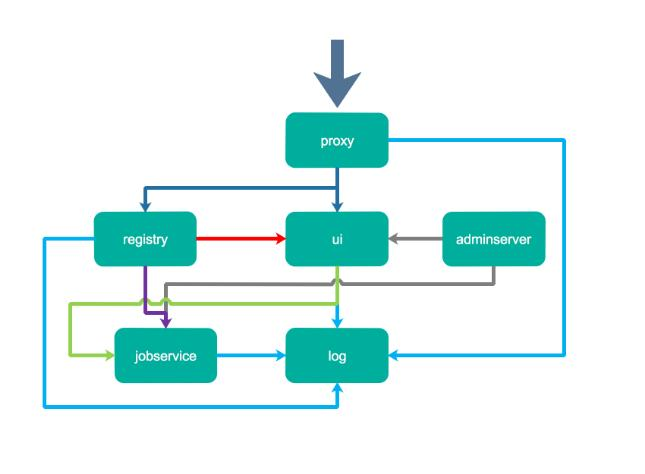

### micro-Services-Tutorial
在开发的过程中相信大家用的都是官方提供的公共的镜像仓库，但是当企业应用的时候为了安全和效率等方面考虑，我们会部署自己的私有仓库Registry。Harbor就是一个这样的开源的企业级的Docker Registry管理项目,它包括权限管理(RBAC)、LDAP、日志审核、管理界面、自我注册、镜像复制和中文支持等功能。

#### harbor搭建docker私有仓库

Harbor是一个企业级Registry管理项目。它对开源的Docker Registry服务进行了扩展和开发，增加了许多企业用户需要的功能。Harbor通常被用于部署成一套组织公司使用的私有环境，这个私有Registry服务对于非常关心安全的企业来说是十分重要的。此外，私有Registry仓库服务还可以避免通过从公域网下载拉取镜像，从而提高企业开发效率。

Harbor是VMware公司开源的企业级[Docker Registry项目](https://github.com/vmware/harbor)。其目标是帮助用户迅速搭建一个企业级的Docker registry服务。它提供了管理Dashboard, 基于角色的访问控制(Role Based Access Control)集成、以及审计日志(Audit logging) 等企业用户需求的功能，同时还原生支持中文。Harbor的组件都是以Docker容器的形式构建的，使用Docker Compose来对它进行部署。

Harbor项目也是使用go语言开发，Web采用beego。容器应用的开发和运行离不开可靠的镜像管理。从安全和效率等方面考虑，在企业私有环境内部署的Registry服务是非常必要的。

Harbor由VMware中国研发团队为企业用户设计的Registry Server开源项目，包括了权限管理(RBAC)、图形管理界面、LDAP/AD集成、审计、自我注册、HA等企业必需的功能，同时针对中国用户的特点，原生支持中文，并计划实现镜像复制(roadmap)等功能。


Harbor系主要由五个容器组成：Proxy、Core Services（包含UI, tokenservice和webhook）、Database、Registry和Log Collector。
<p align="center">

</p>

* Proxy: 提供反向代理服务，用户的不同请求由Proxy分发到后端Registry。Harbor中使用的是官方的nginx镜像。
* Job Services: Harbor项目的核心组件，主要提供权限管理、审计、管理界面UI、token service以及可供其他系统调用的API等功能。
* Database: 提供数据持久化服务，采用了官方的mysql镜像。
* Registry: Docker官方的开源的Registry镜像，主要提供镜像的存储和分发功能。
* Log Collector: 负责收集其他容器的日志并进行日志轮转。


#### 安装Docker
首先安装docker环境，这个可以根据电脑系统的不同，选择不同的安装方式。

* [Mac安装](https://docs.docker.com/docker-for-mac/install/)
* [Ubantu安装](https://docs.docker.com/install/linux/docker-ce/ubuntu/)
* [Windows安装](https://docs.docker.com/docker-for-windows/install/)
* [centos安装](https://docs.docker.com/install/linux/docker-ce/centos/)

我这里是用脚本直接在centos上直接安装的:

```bash
yum-config-manager \
    --add-repo \
    https://download.docker.com/linux/centos/docker-ce.repo;

yum-config-manager --enable docker-ce-edge;

yum-config-manager --disable docker-ce-edge;

yum install docker-ce;

systemctl start docker.service;
systemctl enable docker.service;
```
安装成功之后可以查看下:
```bash
> docker --verison
Docker version 18.06.0-ce, build 0ffa825
```

#### 安装Docker-compose
然后安装docker-compose:
```bash
curl -L https://github.com/docker/compose/releases/download/1.22.0/docker-compose-`uname -s`-`uname -m` > /usr/local/bin/docker-compose

chmod +x /usr/local/bin/docker-compose;

docker-compose --version;
```
安装完成后可以运行下:
```bash
> docker-compose --version
docker-compose version 1.21.2, build a133471
```

#### 搭建Harbor
从[Harbor](https://github.com/goharbor/harbor/releases)下载安装包．
```bash
wget https://github.com/vmware/harbor/releases/download/v1.1.2/harbor-online-installer-v1.1.2.tgz

tar xvf harbor-online-installer-v1.1.2.tgz
```
#### 配置Harbor
进入刚刚解压过后的Harbor文件中,会看到harbor.cfg文件，该文件就是Harbor的配置文件:
```bash
# 1. hostname设置访问地址，可以使用ip、域名，不可以设置为127.0.0.1或localhost
# 2. 默认情况下，harbor使用的端口是80，若使用自定义的端口，除了要改docker-compose.yml文件中的配置外，
# 这里的hostname也要加上自定义的端口，都在在docker login、push时会报错
hostname = 191.234.163.251:5000

# 访问协议，默认是http，也可以设置https，如果设置https，则nginx ssl需要设置on
ui_url_protocol = http

# mysql数据库root用户默认密码root123，实际使用时修改下
db_password = root123

#Maximum number of job workers in job service  
max_job_workers = 3 

#The path of secretkey storage
secretkey_path = /data

# 启动Harbor后，管理员UI登录的密码，默认是Harbor12345
# 若修改了此处的admin登录密码。则登录后台时使用修改后的密码
harbor_admin_password = Harbor12345

# 认证方式，这里支持多种认证方式，如LADP、本次存储、数据库认证。默认是db_auth，mysql数据库认证
auth_mode = db_auth

# 是否开启自注册
self_registration = on

# Token有效时间，默认30分钟
token_expiration = 30

# 用户创建项目权限控制，默认是everyone（所有人），也可以设置为adminonly（只能管理员）
project_creation_restriction = everyone
```

