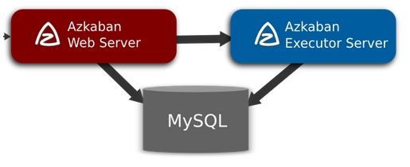

### micro-Services-Tutorial
 微服务最早由Martin Fowler与James Lewis于2014年共同提出，微服务架构风格是一种使用一套小服务来开发单个应用的方式途径，每个服务运行在自己的进程中，并使用轻量级机制通信，通常是HTTP API，这些服务基于业务能力构建，并能够通过自动化部署机制来独立部署，这些服务使用不同的编程语言实现，以及不同数据存储技术，并保持最低限度的集中式管理。然而微服务又需要限流器(Rate Limiter)，数据传输(Trasport 序列化和反序列化),日志(Logging),指标(Metrics),断路器(Circuit breaker),请求追踪(Request tracing ),服务发现(Service Discovery),因此就想写一篇关于微服务和微服务组件的总结来记录下自己使用优化的过程．

#### Azkaban任务调度系统搭建和应用

在业务开发过程中，很多时候需要用到脚本crontab去跑定时任务，但是当你的业务规模变大，需要有监控需求，可视化操作的时候，Crontab就已经显然满足不了需求,因此在解决大数据任务脚本和业务任务脚本时，就选择用Azkaban来作为公共任务调度系统.

[Azkaban官网](https://azkaban.github.io/)给出的介绍，Azkaban是在LinkedIn上创建的批处理工作流作业调度程序，用于运行Hadoop作业。 Azkaban通过作业依赖性解决订单，并提供易于使用的Web用户界面来维护和跟踪您的工作流程.

一个复杂的数据分析系统通常都是由大量任务单元组成，脚本，程序等等，在复杂的情况下简单的Crontab脚本系统就不再可以满足需要了，这时我们就需要任务调度系统了．

通常在各个任务单元之间存在时间先后依赖关系,然而为了更好的有效的组织起这样的复杂脚本执行系统，就需要一个工作流调度系统来调度执行．

Azkaban的通常有三种模式:

<p align="center">

</p>

Azkaban是一套简单的任务调度服务,整体包括三部分webserver、dbserver、executorserver．

* solo-server模式：exec进程和web进程为同一个进程，存放元数据的数据库为H2．
* two-server模式：与之前的单机版本类似，exec进程和web进程分开，存放元数据的数据库为mysql．
* multiple-executor模式：exec进程和web进程在不同的机器上，存放元数据的数据库为mysql．

#### 安装Azkaban

系统配置如下：
* centos-7.4
* mysql-5.7
* azkaban-3.50.0

1. 开始之前要先修改下主机名Azkaban(方便配置时直接配置主机名即可):
```bash
> hostnamectl --static set-hostname azkaban
```

2. 安装Mysql， 这里推荐使用oneinstack的方式安装,它会把基础的依赖安装好,如ntp时间同步,git和gcc-c++．
```bash
> mkdir -p /app/install
> cd /app/install
> wget http://mirrors.linuxeye.com/oneinstack-full.tar.gz && tar xzf oneinstack-full.tar.gz && ./oneinstack/install.sh --db_option 2 --dbinstallmethod 1 --dbrootpwd Sunmi388
# 当然还需要安装一下java环境,可以通过yum安装或者手动安装都行
> yum install java
```

３．下载Azkaban-3.50.0，配置邮件
```bash
> wget https://github.com/azkaban/azkaban/archive/3.50.0.tar.gz
> tar -zxvf 3.50.0.tar.gz
> cd azkaban-3.50.0
# azkaban关于通知邮件存在一个问题需要修改一段代码
> vim azkaban-common/src/main/java/azkaban/utils/EmailMessage.java
# 找到邮件参数配置的地方
:/props
# 增加如下语句
props.put("mail.smtp.socketFactory.class", "javax.net.ssl.SSLSocketFactory");
#Gradle是一个基于Apache Ant和Apache Maven的项目自动化构建工具。-x test 跳过测试
```
