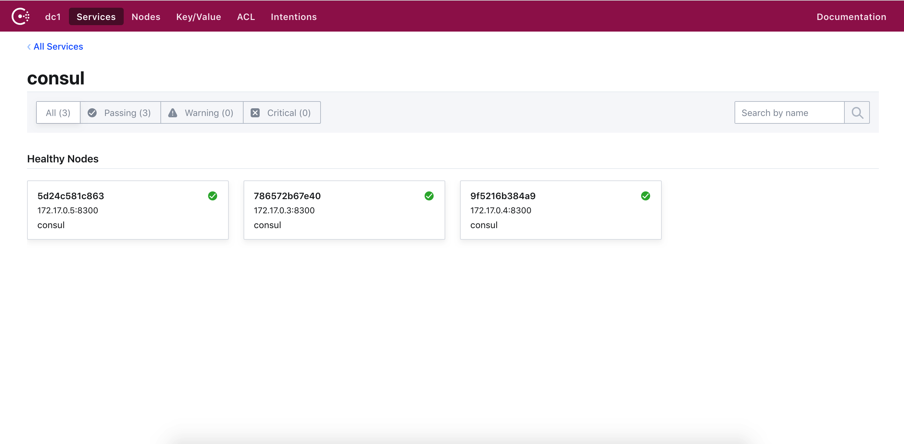
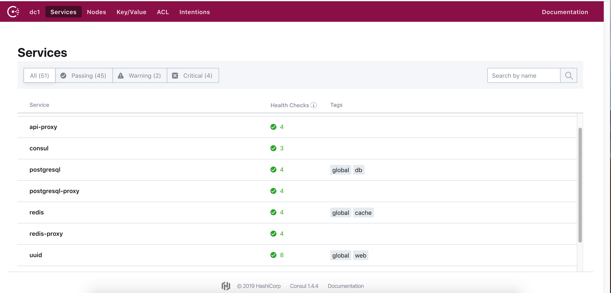

### micro-Services-Tutorial

 微服务最早由Martin Fowler与James Lewis于2011年共同提出，微服务架构风格是一种使用一套小服务来开发单个应用的方式途径，每个服务运行在自己的进程中，并使用轻量级机制通信，通常是HTTP API，这些服务基于业务能力构建，并能够通过自动化部署机制来独立部署，这些服务使用不同的编程语言实现，以及不同数据存储技术，并保持最低限度的集中式管理。然而微服务又需要限流器(Rate Limiter)，数据传输(Trasport 序列化和反序列化),日志(Logging),指标(Metrics)
,断路器(Circuit breaker),请求追踪(Request tracing ),服务发现(Service Discovery),因此就想写一篇关于微服务和微服务组件的总结来记录下自己使用优化的过程．

#### Consul分布式配置中心

Consul作为轻量级的分布式K/V存储系统，搭建方便，可用性高，并且支持多数据中心，提供Web UI进行K/V管理。
此外Consul还可以结合Consul-Template或者在代码中引入Consul Client的相关依赖创建Watcher来实时Watch K/V的变化，是配置管理的不二之选。
Etcd 的 API 比较简单，可以对一个目录或者一个 key 进行 GET，PUT，DELETE 操作，是基于 HTTP 的。Etcd 提供 watch 某个目录或者某个 key 的功能，客户端和 Etcd 集群之间保持着长连接 (long polling)。基于这个长连接，一旦数据发生改变，客户端马上就会收到通知，并且返回的结果是改变后的值和改变前的值，这一点在实际应用中会很有用（这也是后面的 Consul 的槽点之一）。

Etcd 的 watch 和在一般情况下不会漏掉任何的变更。因为 Etcd 不仅存储了当前的键值对，还存储了最近的变更记录，所以如果一个落后于当前状态的 watch 还是可以通过遍历历史变更记录来获取到所有的更新。Etcd 还支持 CompareAndSwap 这个原子操作，首先对一个 key 进行值比较，只有结果一致才会进行下一步的赋值操作。利用这个特性就像利用 x86 的 CAS 实现锁一样可以实现分布式锁。

在 Etcd 中有个 proxy 的概念，它其实是个转发服务器，启动的时候需要指定集群的地址，然后就可以转发客户端的请求到集群，它本身不存储数据。一般来说，在每个服务节点都会启动一个 proxy，所以这个 proxy 也是一个本地 proxy，这样服务节点就不需要知道 Etcd 集群的具体地址，只需要请求本地 proxy。之前提到过一个 k/v 系统还应该支持 leader election，Etcd 可以通过 TTL (time to live) key 来实现。

项目中需要一个配置中心，以取代原先各服务在各自配置文件中写一坨依赖其他服务的配置，达到配置集中管理的目的。以前接触过zookeeper，最近发现consul也可以完成类似的事情，简略预研了一下它们之间的差别 :

组件名      | 一致性的算法 | 数据中心 | 可视化的页面 | 提供接口方式 | 健康检查方式   | 基于组件来做业务进程的主备选举 |
zookeeper  | Paxos      | 支持单个 | no         | TCP        | 对业务 有 侵入 | 自带，可靠|
consul     | Raft       | 支持多个 | WebUI      | HTTP/DNS   | 对业务 无 侵入 | 借助会话和kv操作，不可靠，会话过期会导致多主，需要续签|
etcd       | Raft       | 支持多个 | no         | HTTP/grpc  | 对业务 无 侵入 | 借助会话和kv操作，不可靠，会话过期会导致多主，需要续签|

所以 :
1. 做配置管理，健康检查。则 consul 优于 zookeeper
2. 做主备选举。则 zookeeper 优于 consul

本篇讲述如何用 consul 来做 配置中心 和 健康检查

#### 一. 搭建 Consul 集群

首先，我们需要搭建consul集群，consul集群中的每个结点，以 server 或 client 模式启动。


这里我们用两种方式来实现,一种是docker本地安装,一种是二进制安装.

* docker安装:

1-1. docker上安装consul
```bash
> docker pull consul
```
1-2. 启动第一个consul服务：consul1
```bash
> docker run --name consul1 -d -p 8500:8500 -p 8300:8300 -p 8301:8301 -p 8302:8302 -p 8600:8600 consul:1.2.2 agent -server -bootstrap-expect 2 -ui -bind=0.0.0.0 -client=0.0.0.0
```
- name: DOCKER容器的名称
- net=host: docker参数, 使得docker容器越过了netnamespace的隔离，免去手动指定端口映射的步骤
- 8500: http 端口，用于 http 接口和 web ui.
- 8300: server rpc 端口，同一数据中心 consul server 之间通过该端口通信.
- 8301: serf lan 端口，同一数据中心 consul client 通过该端口通信.
- 8302: serf wan 端口，不同数据中心 consul server 通过该端口通信.
- 8600: dns 端口，用于服务发现.
- bootstrap-expect: 集群至少两台服务器，才能选举集群leader,指定consul将等待几个节点连通，成为一个完整的集群.
- ui: 运行 web 控制台.
- bind: 监听网口，0.0.0.0 表示所有网口，如果不指定默认未127.0.0.1，则无法和容器通信.
- client: 这个表示注册或者查询等一系列客户端对它操作的IP，如果不指定这个IP，默认是127.0.0.1。
- join: 这个表示启动的时候，要加入到哪个集群内，这里就是说要加入到节点1的集群.
- node-id: 这里用这个来指定唯一的节点ID，可以查看这个issue.
- server: consul支持以server或client的模式运行, server是服务发现模块的核心, client主要用于转发请求.
- advertise: 将本机私有IP传递到consul.
- retry-join: 指定要加入的consul节点地址，失败会重试, 可多次指定不同的地址.
- allow_stale: 设置为true, 表明可以从consul集群的任一server节点获取dns信息, false则表明每次请求都会经过consul server leader.

1-3. 获取 consul server1 的 ip 地址.
```bash
> docker inspect --format "{{ .NetworkSettings.IPAddress }}" consul1

172.17.0.3
```

1-4. 启动第二个consul服务：consul2，并加入consul1（使用join命令）
```bash
> docker run --name consul2 -d -p 8501:8500 consul agent -server -ui -bind=0.0.0.0 -client=0.0.0.0 -join 172.17.0.3

9f5216b384a98149174a596901539732fe7ed648c3de992cdb024c10fb4174e3
```
1-5. 启动第三个consul服务：consul3，并加入consul1（使用join命令）
```bash
> docker run --name consul3 -d -p 8502:8500 consul agent -server -ui -bind=0.0.0.0 -client=0.0.0.0 -join 172.17.0.3

5d24c581c8637f65e11e05c28a4b20cc85c0c8aa2781efa35d546899d5e98a19
```

然后浏览器访问：http://localhost:8500 或者 http://localhost:8501,就可以看到consul的管理界面了.

<p align="center">

</p>

* 二进制安装:

1-1. 环境资源
```bash
192.168.1.10 ( server )
192.168.1.16 ( server )
192.168.1.15 ( server )

192.168.1.3  ( client )
192.168.1.12 ( client )
192.168.1.13 ( client )
```

1-2. 安装

consul不需要依赖其他组件，不像zookeeper还要依赖jdk，consul就一个安装包，在所有结点上执行下面的命令 :

```bash
> unzip consul_1.0.6_linux_amd64.zip
> rm -f consul_1.0.6_linux_amd64.zip
> mv consul /usr/local/bin/
> mkdir -p /data/consul/log
> mkdir -p /data/consul/conf
> mkdir -p /data/consul/data
```

1-3. 配置文件

consul的结点，有 server 和 client 之分，配置文件的路径均为 /data/consul/conf/consul.json

server结点的配置文件，以 192.168.1.10 为例 :

```bash
{
    "datacenter"         : "dc_1",                          // 数据中心
    "node_name"          : "consul_1",                      // 该结点的名字
    "bootstrap_expect"   : 1,                               // 集群中，只需要一个server结点的该值为1，其余都为0
    "bind_addr"          : "192.168.1.10",                   // 本机IP
    "client_addr"        : "192.168.1.10",                   // 本机IP
    "retry_join"         : ["192.168.1.168", "192.168.1.15"],  // 其他的server结点的地址
    "server"             : true,                            // 以server模式运行
    "ui"                 : true,                            // 是否在该结点上开启WebUI
    "raft_protocol"      : 3,
    "enable_debug"       : false,
    "enable_syslog"      : false,
    "data_dir"           : "/data/consul/data",
    "log_level"          : "INFO",
    "retry_interval"     : "3s",
    "rejoin_after_leave" : true
}
```
client结点的配置文件，以 192.168.1.1 为例 :

```bash
{
    "datacenter"         : "dc_1",
    "node_name"          : "consul_1",
    "bootstrap_expect"   : 0,                                              // client结点的该值一律为0
    "bind_addr"          : "192.168.1.1",
    "client_addr"        : "192.168.1.1",
    "retry_join"         : ["192.168.1.10", "192.168.1.168", "192.168.1.15"],  // server结点列表
    "server"             : false,                                          // 以client模式运行
    "ui"                 : true,
    "raft_protocol"      : 3,
    "enable_debug"       : false,
    "enable_syslog"      : false,
    "data_dir"           : "/data/consul/data",
    "log_level"          : "INFO",
    "retry_interval"     : "3s",
    "rejoin_after_leave" : true
}
```
不管是server模式还是client模式，配置文件中的 retry_join 都不是要写全的。因为consul使用的是gossip协议来传递信息，只要蔓延开来最终可以不漏掉任何一个server结点就行。

1-1. 集群启停
```bash
启动 : consul agent -config-dir=/data/consul/conf > /data/consul/log/start.log 2>&1 &

关闭 : kill -INT $(ps -ef | grep consul | grep -v grep | awk '{print $2}')

查看集群成员 : consul members -http-addr=192.168.1.10:8500
// 请求地址可以选 任意一个结点
```

1-5. WebUI

一般情况下，consul集群是部署在内网环境下的，我们通常先登到一个公网跳板机，再从跳板机登到consul结点。

此时，我们要访问内网环境的consul的WebUI，可以通过ssh隧道的方式，将 consul_ip:8500 映射到 127.0.0.1:8500，然后访问 http://127.0.0.1:8500/ui 。

<p align="center">

</p>


#### 二. 配置中心

用键值对的方式来管理配置项 :
```bash
Write   : curl -X PUT http://ip:8500/v1/kv/键名 -d '值'
         // 键名可以是多级的，例如 aaa 例如 aaa/bbb
         // 插入 和 更新 都是此命令

Read    : curl -X GET http://ip:8500/v1/kv/键名            单键查询
          curl -X GET http://ip:8500/v1/kv/键名?recurse    递归查出所有子目录的

Delete  : curl -X DELETE http://ip:8500/v1/kv/键名         单键删除
          curl -X DELETE http://ip:8500/v1/kv/键名?recurse 递归删除所有子目录的
```

使用配置中心，需要各业务进行配合 :

各业务启动的时候，将自己本业务的信息（例如自己的地址，端口，密码之类的），写入到consul中，以供其他业务使用。

各业务启动的时候，从consul中读取自己所需要的其他依赖服务的配置，写到自己的内存中，方便使用。

#### 三. 健康检查

首先，我在 192.168.1.15 上，起了一个nginx，用作测试的服务。

3-1. 定义服务
```bash
curl -X PUT http://192.168.1.10:8500/v1/agent/service/register -d '{
    "ID"      : "service_nginx",
    "Name"    : "service_nginx",
    "Tags"    : [ "singleNginx" ],
    "Address" : "192.168.1.15",
    "Port"    : 80,
    "Check"   : {
        "DeregisterCriticalServiceAfter" : "60s",
        "HTTP"     : "http://192.168.1.15",
        "Interval" : "10s"
    },
    "EnableTagOverride" : false
}'

ID      : 服务ID
Name    : 服务名
Tags    : 服务标签
Address : 服务地址
Port    : 服务端口
Check   : 健康检查（以HTTP方式进行检查，当 http://192.168.1.15 返回 2xx 则表示健康。每隔10秒检查一次。当不健康超过60秒则移除该服务）
```

3-2. 为健康检查定义监听

consul watch -http-addr=192.168.1.10:8500 -type=checks -service=service_nginx nohup python /root/healthWatch.py &

-http-addr 可以是任何结点
-type=checks 表示监听的类型是健康检查
-service 指定了监听的服务ID
nohup python /root/healthWatch.py & 则是健康检查的结果发生变化时，触发的命令

下面给出一个 healthWatch.py 的示例
```bash
# -*- coding: utf-8 -*-

import json

# consul watch 会把健康检查的结果，通过标准输入的方式传给脚本，所以要这样获取数据
serviceStatus = raw_input()
serviceStatus = json.loads(serviceStatus)

# 实际使用的时候，你可以根据健康检查的结果，执行（上报服务挂掉 or 重启服务 or 上报服务恢复）之类的逻辑
print serviceStatus
```

#### 参考资料

* [Etcd](https://blog.csdn.net/ahilll/article/details/82012313)
* [Etcd分布式配置中心](https://dreambo8563.github.io/2018/09/11/Etcd-%E5%88%86%E5%B8%83%E5%BC%8F%E9%85%8D%E7%BD%AE%E1%B8%AD%E5%BF%83/)
* [Etcd使用入门](https://cizixs.com/20168/08/02/intro-to-etcd/)
* [Etcd指南](https://skyao.gitbooks.io/learning-etcd3/content/documentation/op-guide/clustering.html)
* [Confd的安装与使用](https://blog.csdn.net/bbwangj/article/details/82953786)
* [Confd+etcd实现高可用自动发现](http://www.361way.com/confd-etcd/5170.html)
* [Etcd集群搭建](http://www.361way.com/etcd-cluster/5168.html)
* [Etcd中文官方网站](http://etcd.doczh.cn/documentation/dev-guide/local_cluster.html)
* [Kubernetes系列](https://www.lijiaocn.com/tags/kubernetes.html)
* [Docker结合Consul实现服务发现](http://dockone.io/article/1359)
